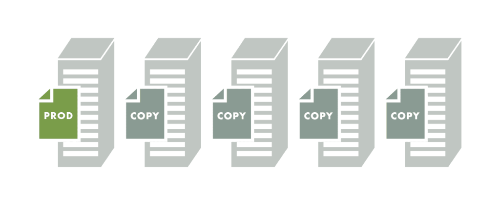

% **题目**
% 史春奇
% 2025年3月1日


# 标题1

## 二级标题1
内容主题如下：

1. 要点1
2. 要点2
3. 要点3
4. 要点4

相关图片：

{height=40%}


<!-- ############################################################### -->
# 总结

## Thank You ~


<!-- 
## Presentation Tools

- PowerPoint (GUI)
- Keynote (GUI)
- Beamer (Text)

GUI is difficult.
Writing \TeX is also difficult.

Find more convinient tools!

## Use Pandoc

Pandoc - [pandoc.org](http://pandoc.org/)

is a *document* $\mapsto$ *document* convert tool

- many document formats are supported!!
    1. `.mkd` (markdown)
    1. `.html` `.xml`
    1. `.docx` (Microsoft Words)
    1. `.tex` `.pdf`
    1. and more
- *template* is used for convert
    - pandoc has many templates for many formats
    - you can custom and use your own templates

## Example

### a document `.tex` from `.mkd`

Pandoc use usual **template** for `.tex`.
The formats of input and output are inferred from the file extensions.

```bash
pandoc -o report.tex report.mkd
```

### a slide `.tex` from `.mkd`

specify the output format as `beamer`

```bash
pandoc -t beamer -o report.tex report.mkd
```

# Method

## My Way to Write Presentation Slides

1. write `.mkd`
2. get `beamer` file by `pandoc`

```bash
pandoc -s -t beamer \
  --template ./themes/pondering.tex \
  -o out.tex in.mkd
```

(also see `Makefile`)

3. compile with `platex` and get `.pdf`

```bash
platex out
dvipdfmx out
zathura out.pdf
```

# Check the Template

## enumerate and itemize

1. one
1. two
    - 2
    - 弐
1. three

- itemize
    - subitemize
        - subsubitemize
        - subsubitemize
- itemize
- itemize

## Block

In mkd, a `###` makes a `block`

### block title

block inner

### block title

block inner

## code highlight

```bash
seq 1 100 | factor | awk 'NF==2{print $2}'
```

```haskell
main :: IO ()
```

```python
if __name__ == "__main__":
  pass
```

## embbed \TeX

**BTW**:

Markdown grammer is poor.
To realize a little advanced, we need \TeX.

1. \TeX can be embbed in `mkd`
    - which are never changed by `pandoc`
1. All inner of a \TeX are judged as \TeX

    - This means: cannot write `mkd` in \TeX

## Example - twocolumns

Markdown has no grammer about columns.
My template defined special syntax (\TeX macros) for columns.

\BeginColumn{.4}

```tex
\BeginColumn{.6}
  Left column
\Column
  Right column
\EndColumn{.4}
```

\Column{.1}

generates

\Column{.5}

```tex
\begin{columns}
  \column{.6\textwidth}
    Left column
  \column{.4\textwidth}
    Right column
\end{columns}
```

\EndColumn
-->